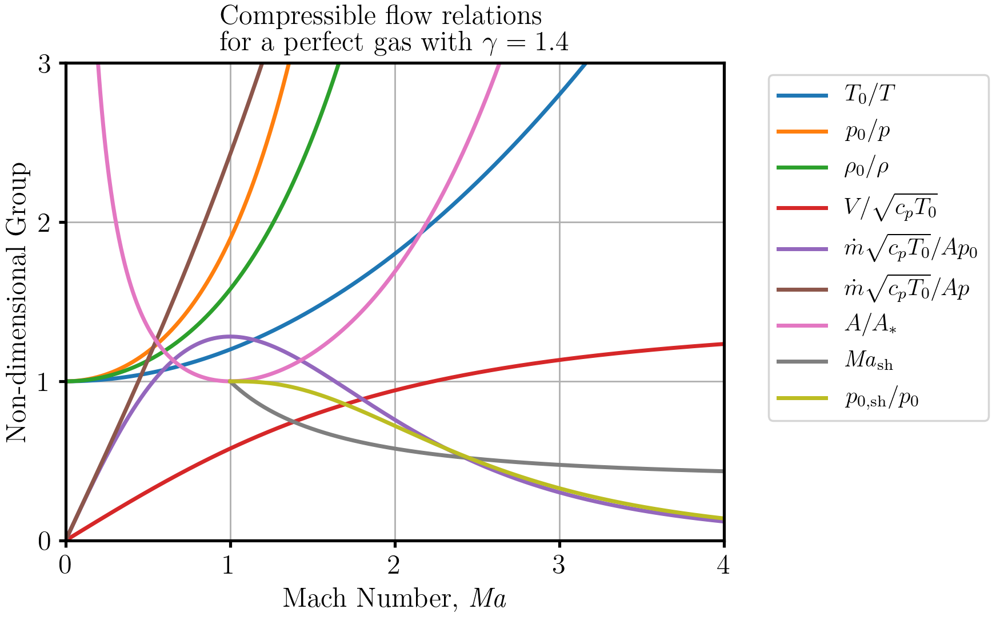

compflow Documentation
======================

The compflow library contains functions to convert back and forth between Mach
number and other non-dimensional groups in compressible flows. By using a
NumPy--Fortran interface, the code is vectorised and lightning-fast.

.. toctree::
   :maxdepth: 1

   about
   usage
   api

